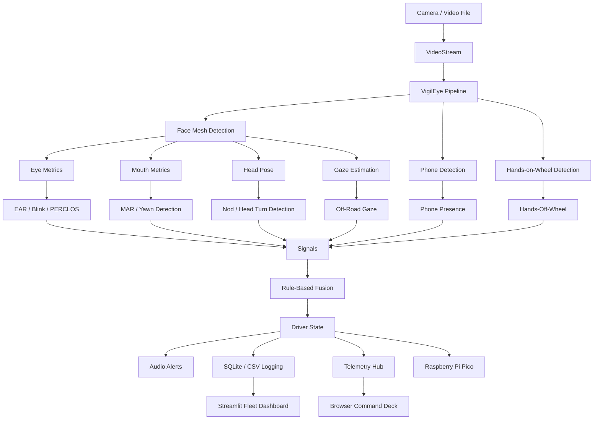
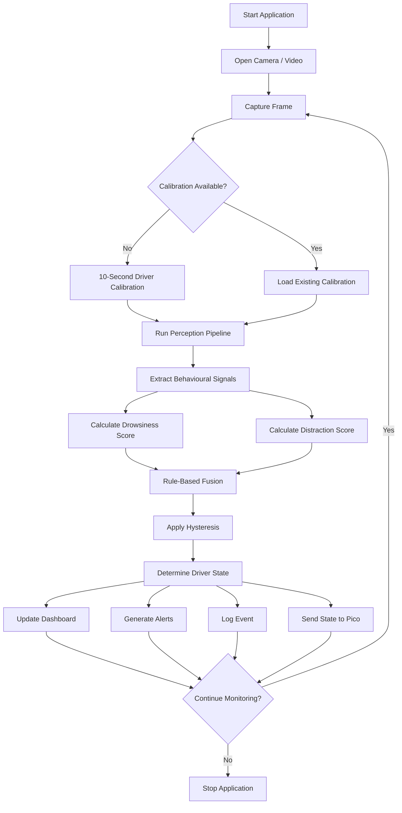
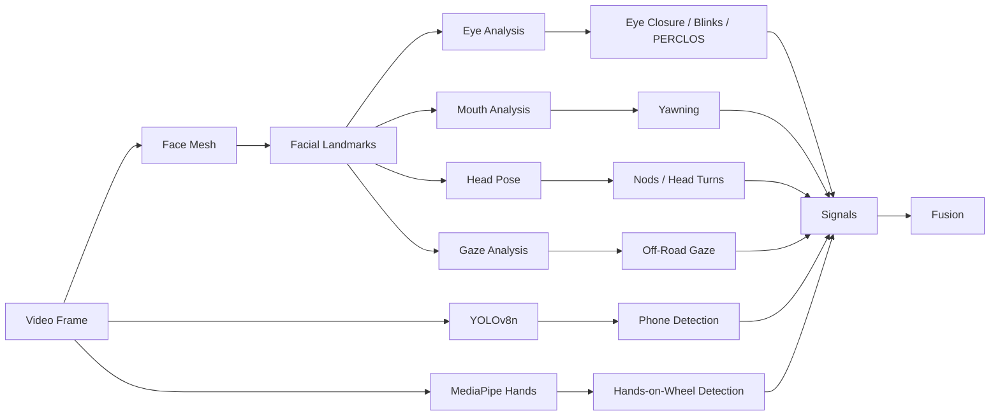
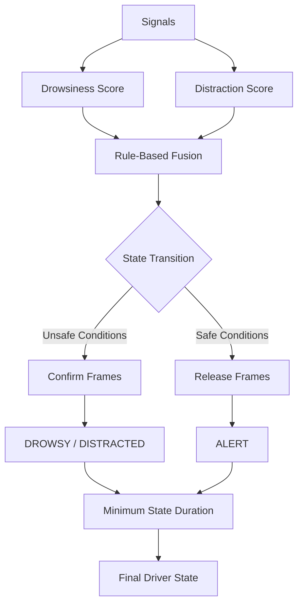
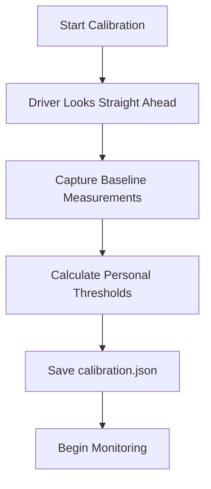
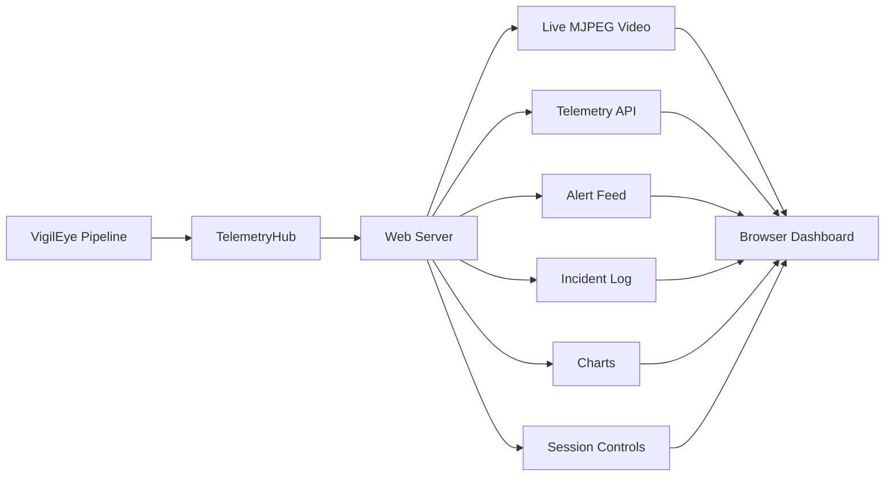
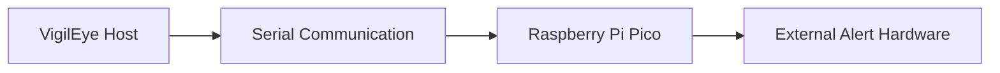

# VigilEye

### Real-Time Driver Drowsiness, Fatigue and Distraction Detection

VigilEye is a camera-based driver monitoring system that analyses facial landmarks, eye closure, yawning, head pose, gaze direction, phone usage, and hands-on-wheel behaviour to detect potential driver drowsiness and distraction.

The system combines real-time computer vision, rule-based sensor fusion, temporal analysis, audio alerts, event logging, and a browser-based monitoring dashboard.

The project is designed for driver safety applications and edge-device deployment.

## Features

* **Real-Time Driver Monitoring**
  Processes live camera input and analyses driver behaviour.

* **Drowsiness Detection**
  Detects eye closure, prolonged eye closure, micro-sleeps, and yawning.

* **Distraction Detection**
  Identifies sustained head turns, off-road gaze, phone usage, and hands-off-wheel behaviour.

* **Head Pose Estimation**
  Tracks yaw, pitch, and roll to identify head movement and potential distraction.

* **Gaze Estimation**
  Estimates eye direction and tracks sustained off-road gaze.

* **Phone Detection**
  Uses YOLOv8n to detect phone usage.

* **Hands-on-Wheel Detection**
  Uses MediaPipe Hands and a defined wheel region of interest.

* **Driver-Specific Calibration**
  Establishes a baseline during a 10-second calibration period.

* **Rule-Based Fusion**
  Combines multiple behavioural signals into stable driver states.

* **Temporal Fusion**
  Supports an LSTM/GRU-based temporal model for future learned fusion.

* **Audio Alerts**
  Provides escalating alerts with cooldown and escalation controls.

* **Browser-Based Command Deck**
  Displays live video, metrics, charts, alerts, and session information.

* **Event Logging**
  Stores frame-level data in CSV and event data in SQLite.

* **Fleet Analytics Dashboard**
  Provides historical session analysis using Streamlit.

* **Optional Raspberry Pi Pico Integration**
  Supports serial communication with external hardware for warning signals.

## Driver States

VigilEye classifies the current driver state into four categories:

| State          | Description                                                   |
| -------------- | ------------------------------------------------------------- |
| **ALERT**      | Driver is not currently showing significant unsafe behaviour. |
| **DROWSY**     | Behaviour indicates possible drowsiness or fatigue.           |
| **DISTRACTED** | Behaviour indicates possible distraction.                     |
| **NO_DRIVER**  | No driver is detected in the camera view.                     |

Drowsiness and distraction are evaluated separately because they require different safety responses.

## System Architecture



The pipeline produces a structured `Signals` record for each frame. These signals are then processed by the fusion layer before being sent to alerts, logging, hardware signalling, and the web interface.

## Application Workflow



## Detection Pipeline



## Signal Processing

VigilEye extracts multiple behavioural signals from each frame.

| Signal                    | Purpose                                               |
| ------------------------- | ----------------------------------------------------- |
| **EAR**                   | Measures eye openness.                                |
| **PERCLOS**               | Tracks the proportion of time the eyes remain closed. |
| **Blink Rate**            | Measures blinking frequency.                          |
| **Micro-Sleep Detection** | Identifies prolonged eye closure.                     |
| **MAR**                   | Measures mouth opening.                               |
| **Yawn Detection**        | Identifies sustained yawning.                         |
| **Head Pose**             | Estimates yaw, pitch, and roll.                       |
| **Nod Detection**         | Detects head drops.                                   |
| **Head Turn Detection**   | Detects sustained head turns.                         |
| **Gaze Estimation**       | Tracks eye direction.                                 |
| **Phone Detection**       | Detects phone presence.                               |
| **Hands-on-Wheel**        | Checks whether hands remain within the wheel region.  |

These signals are combined into a single per-frame record before fusion.

## Fusion and State Management

The fusion layer combines the extracted signals into drowsiness and distraction scores.



The system uses **hysteresis** to reduce unstable state changes. The documented configuration requires 8 confirming frames to enter an unsafe state, 20 frames to leave it, and a minimum state duration of 1.5 seconds.

## Calibration

VigilEye uses driver-specific calibration instead of relying only on fixed thresholds.



The calibration process runs for 10 seconds and stores the baseline in `calibration.json`.

## Web Interface

The browser-based **Command Deck** provides a live monitoring interface.



The interface includes live annotated video, metrics, charts, alert information, incident history, and session controls.

## Raspberry Pi Pico Integration

The Raspberry Pi Pico is an **optional external alerting device**.



The host sends driver-state strings over a serial connection. The Pico can be used to control external warning hardware such as LEDs, a buzzer, or other alerting components.

The host-side serial integration is implemented, while the firmware still needs to be committed and flashed to the board.

## Tech Stack

| Technology              | Purpose                           |
| ----------------------- | --------------------------------- |
| **Python**              | Core application development      |
| **OpenCV**              | Camera capture and visualisation  |
| **MediaPipe Face Mesh** | Facial landmark detection         |
| **MediaPipe Hands**     | Hands-on-wheel detection          |
| **YOLOv8n**             | Phone detection                   |
| **PyTorch**             | CNN and temporal model support    |
| **MobileNetV3-Small**   | Drowsiness classification model   |
| **LSTM / GRU**          | Temporal fusion model             |
| **NumPy**               | Numerical processing              |
| **Pandas**              | Data processing                   |
| **Scikit-learn**        | Machine learning utilities        |
| **PyYAML**              | Configuration management          |
| **Streamlit**           | Fleet analytics dashboard         |
| **SQLite**              | Event storage                     |
| **CSV**                 | Frame-level logging               |
| **HTML / JavaScript**   | Browser dashboard                 |
| **Raspberry Pi Pico**   | Optional external hardware alerts |

The documented dependency set includes OpenCV, MediaPipe, Ultralytics, PyTorch, Streamlit, and related Python packages.

## Project Structure

```text
VigilEye/
│
├── run.py
├── config.yaml
├── requirements.txt
├── README.md
├── test_cnn_live.py
│
├── vigileye/
│   ├── __init__.py
│   ├── config.py
│   ├── landmarks.py
│   ├── metrics.py
│   ├── head_pose.py
│   ├── gaze.py
│   ├── distraction.py
│   ├── fusion.py
│   ├── temporal_model.py
│   ├── calibration.py
│   ├── alerts.py
│   ├── logger.py
│   ├── visualize.py
│   ├── video.py
│   ├── pipeline.py
│   ├── cnn_inference.py
│   ├── pico_alert.py
│   │
│   └── webui/
│       ├── __init__.py
│       ├── hub.py
│       ├── server.py
│       └── index.html
│
├── dashboard/
│   └── app.py
│
├── training/
│   └── train_drowsiness.py
│
├── scripts/
│   ├── collect_features.py
│   ├── train_fusion.py
│   └── evaluate.py
│
├── tests/
│   └── test_metrics.py
│
├── models/
│
├── data/
│
└── logs/
```

The repository layout above is based on the documented project structure.

## Getting Started

### Prerequisites

* Python 3.12 or a compatible Python version
* A webcam or video source
* Git
* Required Python dependencies
* Optional: Raspberry Pi Pico and serial connection

### Clone the Repository

```bash
git clone https://github.com/<your-username>/VigilEye.git
cd VigilEye
```

### Create a Virtual Environment

```bash
python -m venv venv
```

**Windows:**

```bash
venv\Scripts\activate
```

**macOS / Linux:**

```bash
source venv/bin/activate
```

### Install Dependencies

```bash
pip install -r requirements.txt
```

### Run the Application

```bash
python run.py
```

The application starts the camera pipeline and opens the browser-based Command Deck. On the first launch, the system performs a 10-second calibration before monitoring begins.

### Run the Fleet Dashboard

```bash
streamlit run dashboard/app.py
```

The Streamlit dashboard reads the SQLite event database and provides historical session analytics.

## Configuration

VigilEye uses `config.yaml` for tunable thresholds and runtime settings.

Example configuration categories include:

```yaml
camera:
  width: 480
  height: 360

eye:
  perclos_window_s: 60
  perclos_warn: 0.15
  perclos_critical: 0.30

mouth:
  yawn_min_s: 1.2

head:
  off_road_min_s: 2.0

objects:
  enabled: true
  every_n_frames: 5

fusion:
  mode: rule
  drowsy_threshold: 0.45
  distract_threshold: 0.45

alerts:
  enabled: true
  cooldown_s: 5
  escalate_s: 8

logging:
  dir: logs
  frame_log: true
  db: logs/vigileye.db
```

The complete configuration reference is maintained in `config.yaml`.

## Model Training

The repository includes training scripts for future learned components.

### Drowsiness Classifier

The documented training pipeline uses MobileNetV3-Small for binary drowsiness classification.

```bash
python training/train_drowsiness.py
```

The trained checkpoint is saved as:

```text
models/drowsiness_model.pth
```

The CNN is optional in the current pipeline and does not contribute until a trained checkpoint is available.

### Temporal Fusion Model

The temporal model uses a sliding window of behavioural features.

```bash
python scripts/collect_features.py --videos data/videos
python scripts/train_fusion.py --features data/features.csv --epochs 40
```

After training, the temporal model can be used with:

```bash
python run.py --mode temporal
```

The documented temporal model is designed to learn fatigue patterns from sequential behavioural signals.

## Logging and Analytics

VigilEye stores:

* Frame-level measurements in CSV.
* Driver-state events in SQLite.
* Session information for historical analysis.

The Streamlit dashboard provides:

* Session and frame totals.
* Drowsiness and distraction alert counts.
* Alerts by hour.
* Risk scores over time.
* Driver risk ranking.
* Session history.
* Raw alert logs.

## Current Project Status

### Working

* Real-time perception pipeline.
* Facial landmark processing.
* Eye, mouth, head pose, and gaze analysis.
* Phone and hands-on-wheel detection.
* Rule-based fusion.
* Driver-state classification.
* Audio alerts.
* Driver calibration.
* CSV and SQLite logging.
* Browser Command Deck.
* Streamlit fleet dashboard.
* Host-side Raspberry Pi Pico serial integration.

### In Development

* Training the MobileNetV3 drowsiness classifier.
* Training the temporal LSTM/GRU fusion model.
* Committing and flashing Pico firmware.
* Testing the complete hardware alert path.
* Validating performance on labelled driving footage.

The current implementation has been verified through live runs, but the learned models and complete Pico hardware path are not yet finished.

## Performance

The documented CPU-only tests achieved approximately **4–5 FPS** on the development machine with the full pipeline enabled.

The project’s design targets are:

| Configuration                           | Target    |
| --------------------------------------- | --------- |
| Face mesh + fusion only                 | 25–30 FPS |
| Full pipeline with YOLO every 5th frame | 12–18 FPS |

Performance depends on the hardware, camera resolution, and enabled detection modules.

## Future Scope

* Complete training and integration of the drowsiness CNN.
* Complete training and integration of the temporal fusion model.
* Deploy the system on Jetson Nano or Raspberry Pi-class edge hardware.
* Add TensorRT optimisation for YOLO inference.
* Complete Raspberry Pi Pico firmware integration.
* Add hardware watchdog and keep-alive support.
* Improve performance through inference optimisation.
* Validate the system using labelled driving footage.
* Expand the fleet analytics dashboard.

## Limitations

* The current learned models are not yet trained.
* The system has not been fully validated on a large labelled dataset.
* CPU-only inference limits real-time performance.
* The Pico hardware path requires additional firmware and testing.
* Camera placement and lighting can affect detection accuracy.
* The system is intended as a driver-assistance tool, not a replacement for responsible driving.

## Disclaimer

VigilEye is a research and development project intended for educational and experimental purposes. It is not a certified automotive safety system and should not be relied upon as the sole means of preventing accidents.

Drivers must remain responsible for safe vehicle operation.

## License

This project is intended for educational and development purposes.

## Author

Syed Misbahul Islam

GitHub: https://github.com/Syed-Misbahul-Islam

## Acknowledgements

* MediaPipe
* OpenCV
* Ultralytics
* PyTorch
* Streamlit
* Raspberry Pi
